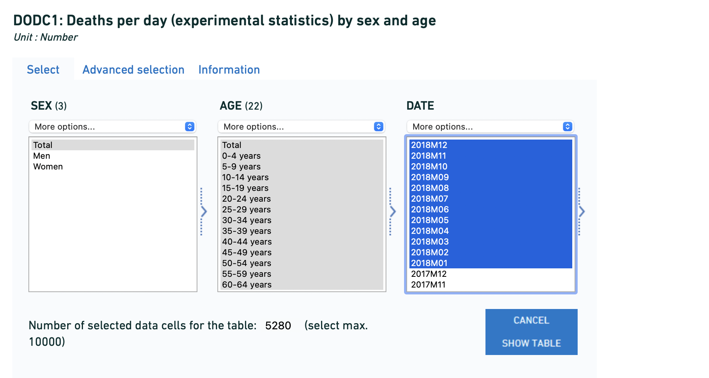
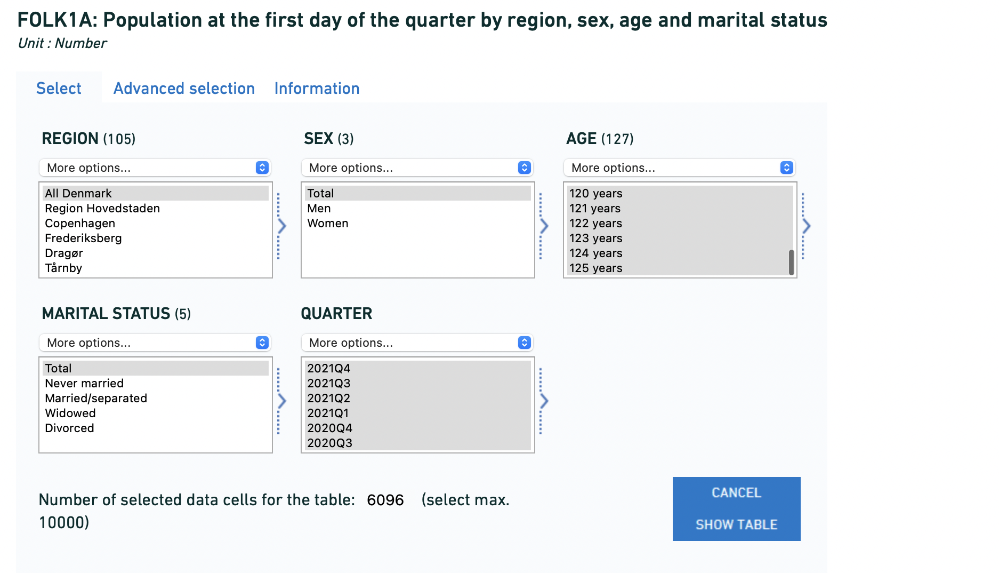

```{r setup, include=FALSE}
knitr::opts_chunk$set(echo = TRUE,
                      fig.height = 5,
                      fig.height = 6)
```

## sources

Deaths: DODC1: Deaths per day (experimental statistics) by sex and age https://www.statbank.dk/20014 
Downloaded all ages. csv download of default layout



Population: FOLK1A: Population at the first day of the quarter by region, sex, age and marital status
https://www.statbank.dk/20014
Downloaded all ages. csv download of default layout



Daily Covid Deaths: ourworldindata, https://github.com/owid/covid-19-data/tree/master/public/data

(this file is not included as part of this repo due to size)

Latest Denmark Omicron report from https://covid19.ssi.dk/virusvarianter/omikron

If you are wanting to use updated data relative to this version, download deaths for Q4 2021, and any 2022 deaths and put them in the statbank_dk_deaths_day folder. If there is 2022 Population data, downland 2010-2022 quarterly populations and replace the file in the other_data folder. Download the latests ourworldindata dataset.

```{r libraries, message=FALSE, warning=FALSE}
library(dplyr)
library(readr)
library(lubridate)
library(tidyr)
library(RcppRoll)
library(ggplot2)
library(ggthemes)
```

```{r helpers}
# Colourset
six_cols <- colorblind_pal()(6)

#graph styling
 theme_davidhood <- function(){
    theme_minimal() %+replace%  
      theme(panel.grid = element_blank(),
            axis.line.x = element_line(size=0.1),
            axis.line.y = element_line(size=0.1),
            axis.ticks = element_line(size=0.2),
            strip.background = element_rect(fill= "#FFFFFF", colour="#EFEFEF"),
            strip.text = element_text(size = 13,
                                      margin = margin(t = 5, r = 5, b = 5, l = 5, unit = "pt")),
            strip.placement = "inside",
            panel.background = element_rect(fill = "#FFFFFF", colour = "#FFFFFF"),
            panel.spacing = unit(1.5, "lines"),
            plot.title = element_text(size = 14,
                                      lineheight = 1.23,
                                      margin=margin(t = 0, r = 0, b = 10, l = 10, unit = "pt"),
                                      hjust=0),
            plot.background = element_rect(fill = "#FCFCFC"),
            axis.title = element_text(size=13),
            plot.caption = element_text(margin=margin(t = 5, r = 5, b = 5, l = 5, unit = "pt"),
                                        size=11, hjust=1),
            plot.caption.position = "plot",
            plot.margin = margin(0.3, 0.4, 0.3, 0.3, "cm"))}
```


```{r data_loader, warning=FALSE, message=FALSE}
# Deaths
daily_death_csvs <- list.files("statbank_dk_deaths_day", pattern = "csv$",
                               full.names = TRUE)
read_w_rearrange <- function(x){
  csv_contents <- read_csv(x, col_types = cols(.default = col_character()), skip=1) %>%
    rename(Age = ...2) %>%
    select(-...1) %>%
    filter(!is.na(Age)) %>%
    gather(key="DateChr", value="Deaths", -1) %>%
    mutate(Deaths = as.numeric(Deaths),
           DateDt = ymd(DateChr),
           Source = gsub(".*/", "",x)) %>%
    select(-DateChr)
}
daily_deaths <- bind_rows(lapply(daily_death_csvs, read_w_rearrange))

# population
# I am offsetting population to the following quarter to have a population
# for death rate calculations in JAnuary 2022.

quarter_pop <- read_csv("other_data/statbank_dk_population_start_Qtr.csv", 
                        col_types = cols(.default = col_character()), skip=3) %>%
  select(-1,-2,-3) %>% 
  rename(AgeY=...4) %>%
  filter(!is.na(AgeY)) %>%
  gather(key="QtrChr", value="Population", -AgeY) %>%
  separate(QtrChr, into=c("YR","QR"), sep="Q") %>%
  mutate(Population = as.numeric(Population),
         DateDt = floor_date(ymd(paste(YR, as.numeric(QR)*3,30)) + 
                               days(20), "quarter"),
         NoYr = gsub(" years*","",AgeY),
         Age = case_when(NoYr == "Total" ~ "Total",
                         nchar(NoYr) > 2 ~ "100 years and over",
                         TRUE ~ paste0(floor(as.numeric(NoYr)/5)*5,"-",
                                       floor(as.numeric(NoYr)/5)*5 + 4,
                                       " years"))) %>%
  select(DateDt, Age, Population) %>%
  group_by(DateDt, Age) %>%
  summarise(Population = sum(Population)) %>%
  ungroup()
  

# ourworldindata covid explorer dataset
owdDNK <- read_csv("other_data/owid-covid-data_2022_01_07.csv", 
                col_types = cols(date = col_character())) %>%
  filter(iso_code == "DNK") %>%
  mutate(DateDt = ymd(date)) %>%
  select(DateDt, new_cases, new_deaths, 
         icu_patients, hosp_patients) %>%
  mutate(new_cases = ifelse(is.na(new_cases), 0, new_cases),
         new_deaths = ifelse(is.na(new_deaths), 0, new_deaths),
         icu_patients = ifelse(is.na(icu_patients), 0, icu_patients),
         hosp_patients = ifelse(is.na(hosp_patients), 0, hosp_patients),
         Age = "Total")
```

Joining Data together

```{r}
dnk <- daily_deaths %>% 
  left_join(quarter_pop, by = c("Age", "DateDt")) %>%
  arrange(Age, DateDt) %>%
  group_by(Age) %>%
  fill(Population) %>%
  ungroup() %>%
  left_join(owdDNK, by = c("Age", "DateDt")) 
  
```

Example  of usage: raw deaths per 100,000

This alarms me if the mortality rate for the year since May 2021 is higher than 2020, it would be consistent with the recent insurance industry work on long covid, but it also means our conceptions of "getting better" are drastically and dangerously wrong. And our incentives to not catch it at all are seriously underestimated. 

```{r}
dnk %>% 
  filter(Age == "Total") %>%
  arrange(DateDt) %>%
  mutate(Year = year(DateDt),
         DoY = yday(DateDt),
         Date2020 = ymd("2019-12-31") + days(DoY), #note leap year
         sevenDay_Deaths = roll_meanr(Deaths, 7),
         sevenDay_Population = roll_meanr(Population, 7),
         sevenDay_Covid_Deaths = roll_meanr(new_deaths, 7),
         mortrate100K = 100000 * sevenDay_Deaths/ sevenDay_Population,
         Years = factor(ifelse(Year < 2020, "2010-2019", as.character(Year)))) %>%
  ggplot(aes(x=Date2020, y=mortrate100K, group=factor(Year), colour=Years)) +
  geom_line() + theme_davidhood() +
  scale_colour_manual(values=c("#DEDEDEDE", six_cols[2:3])) +
  labs(title="Denmark: rolling seven day average mortality per 100000 people",
       x = "Time of year", y="Deaths per 100,000") +
  scale_x_date(date_labels = "%b") +
  annotate("line", x=ymd(c("2020-12-15", "2020-12-31")),
           y=c(3.4,3.4)) +
  annotate("text", x=ymd("2020-12-21"), y=3.39, label="2021 still\nmay be\nrevised up",vjust=1)
```

Example  of usage: Deaths per 100,000 as percent of 2010-19 mean, which is just as bad. 


```{r}
historic_mean <- dnk %>% 
  filter(Age == "Total") %>%
  arrange(DateDt) %>%
  mutate(Year = year(DateDt),
         DoY = yday(DateDt),
         Date2020 = ymd("2019-12-31") + days(DoY), #note leap year
         sevenDay_Deaths = roll_meanr(Deaths, 7),
         sevenDay_Population = roll_meanr(Population, 7),
         sevenDay_Covid_Deaths = roll_meanr(new_deaths, 7),
         mortrate100K = 100000 * sevenDay_Deaths/ sevenDay_Population,
         Years = factor(ifelse(Year < 2020, "2010-2019", as.character(Year)))) %>%
  filter(Year < 2020) %>%
  group_by(DoY) %>%
  summarise(hmean = mean(mortrate100K))

dnk %>% 
  filter(Age == "Total") %>%
  arrange(DateDt) %>%
  mutate(Year = year(DateDt),
         DoY = yday(DateDt),
         Date2020 = ymd("2019-12-31") + days(DoY), #note leap year
         sevenDay_Deaths = roll_meanr(Deaths, 7),
         sevenDay_Population = roll_meanr(Population, 7),
         sevenDay_Covid_Deaths = roll_meanr(new_deaths, 7),
         mortrate100K = 100000 * sevenDay_Deaths/ sevenDay_Population,
         Years = factor(ifelse(Year < 2020, "2010-2019", as.character(Year)))) %>%
  filter(Year > 2019) %>%
  inner_join(historic_mean, by = "DoY") %>%
  mutate(percent = 100 * mortrate100K/hmean) %>%
    ggplot(aes(x=Date2020, y=percent, group=factor(Year), colour=Years)) +
  geom_hline(yintercept = 100, linetype=2) +
  geom_line() + theme_davidhood() +
  scale_colour_manual(values=c(six_cols[2:3])) +
  labs(title="Denmark: rolling seven day average mortality per 100000 people\nas percentage of 2010-2019 mean",
       x = "Time of year", y="percent compared to mean") +
  scale_x_date(date_labels = "%b") +
  annotate("line", x=ymd(c("2020-12-15", "2020-12-31")),
           y=c(125,125)) +
  annotate("text", x=ymd("2020-12-21"), y=124, label="2021 still\nmay be\nrevised up",vjust=1)

  
```


